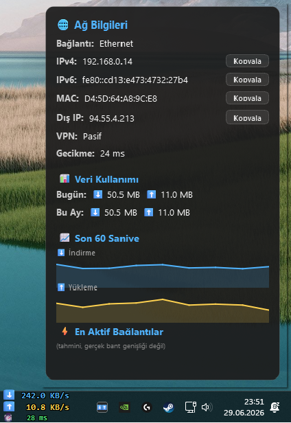

# NetStatOnTaskBar

A lightweight, fully transparent Windows taskbar overlay that displays real-time network download speed, upload speed, and live ping — directly on the taskbar, without occupying any space.



---

## ✨ Features

### Core Display
- **Real-time speed overlay** on the Windows taskbar, updating every second
- Displays **download (⬇)** and **upload (⬆)** speeds simultaneously
- Shows **live ping latency (⏱ ms)** directly on the taskbar widget with color-coded feedback:
  - 🟢 Green: < 60 ms
  - 🟡 Yellow: 60–150 ms
  - 🔴 Red: > 150 ms
- Shows a **🔒 lock icon** next to ping when a VPN connection is active
- **Fully click-through** — mouse clicks pass straight through the overlay to whatever is behind it
- **Fully transparent** background — only the text is visible, no black box or border

### Multi-Monitor Support
- Automatically detects all taskbars (`Shell_TrayWnd` for primary, `SecondaryTrayWnd` for secondary monitors)
- Spawns a separate overlay instance on **each monitor's taskbar**, perfectly positioned next to the clock
- A **2-second realign timer** continuously keeps every widget snapped to the correct taskbar position

### Network Info Popup (Left-click on tray icon)
- Floating Fluent-style panel showing:
  - **Connection type** (Wi-Fi / Ethernet / adapter name)
  - **Local IPv4 and IPv6** addresses
  - **MAC address**
  - **Public (external) IP** — fetched asynchronously so the UI never freezes
  - **VPN status** — detects WireGuard, NordLynx, OpenVPN, Tailscale, Mullvad, and more
  - **Live ping** refreshed every second
  - **Daily and monthly data usage** totals (persisted across restarts)
  - **60-second sparkline charts** for download and upload speeds
  - **Top 5 most active processes** ranked by established connections
  - One-click **copy buttons** for all address values

### Built-in Internet Speed Test (Right-click → 🚀 Hız Testi)
- One-click speed test launched directly from the tray menu — no browser or third-party tool needed
- Measures and displays:
  - **Ping** (avg round-trip to 1.1.1.1:443, 5 samples)
  - **Jitter** (max − min of ping samples)
  - **Download speed** (Mbps)
  - **Upload speed** (Mbps)
- Uses multiple **fallback servers** tested in sequence until one succeeds:
  - Download: Tele2 (10 MB), Hetzner (partial 100 MB), Cloudflare `__down`
  - Upload: Tele2, Cloudflare `__up`
- Progress is shown live while the test is running; results update in real time
- Window auto-closes when it loses focus **only if no test is running**

### Settings Window (Right-click → ⚙ Ayarlar)
- **5 color themes**: Green, Blue, Purple, Red, Classic (Mono)
- **Speed unit toggle**: Auto (B/KB/MB/GB/s) or fixed Mbps
- **Windows autostart** toggle — writes to `HKCU\Software\Microsoft\Windows\CurrentVersion\Run`
- **Widget position adjustment** — drag mode toggled from the tray menu

### Position Adjustment (Drag Mode)
- Right-click the tray icon → **📍 Pozisyonu Ayarla**
- A dashed border appears on the overlay — click and drag to reposition
- The offset is saved to `config.json` and persists between sessions

### Connection Status Notifications
- Tray icon changes to **red** when internet is lost
- System tray notification on disconnect and reconnect events
- Requires 3 consecutive failures before declaring the connection down (prevents false alarms)

### Data Usage Tracking
- Accumulates **per-day** download and upload byte counts
- Stores up to **60 days** of history, auto-pruning older entries
- Displayed as KB / MB / GB in the info popup
- Saved to disk every 30 seconds and on clean exit

---

## 🖥️ Requirements

| Requirement | Detail |
|---|---|
| **OS** | Windows 10 / Windows 11 |
| **Python** | 3.10 or newer (64-bit) |
| **PyQt6** | `pip install PyQt6` |
| **psutil** | `pip install psutil` |

> All other dependencies (`ctypes`, `winreg`, `socket`, `threading`, `urllib`, `json`, `deque`) are part of the Python standard library.

---

## 🚀 Installation & Usage

### 1. Clone or download the repository

```bash
git clone https://github.com/your-username/NetStatOnTaskBar.git
cd NetStatOnTaskBar
```

### 2. Install dependencies

```bash
pip install PyQt6 psutil
```

### 3. Run

```bash
python NetStatOnTaskBar.py
```

The overlay will appear on your taskbar immediately. A tray icon (⬇⬆) will appear in the system tray.

---

## 🗂️ File Structure

```
NetStatOnTaskBar/
├── NetStatOnTaskBar.py   # Entire application — single file, no modules required
├── .gitignore
└── README.md
```

Configuration is stored automatically at:
```
%APPDATA%\NetStatOnTaskBar\config.json
```

---

## ⚙️ Configuration Reference (`config.json`)

The config file is created automatically on first run. You can edit it manually if needed.

```json
{
  "theme": "green",
  "unit": "auto",
  "autostart": false,
  "widget_offset": { "x": 0, "y": 0 },
  "usage": {
    "2026-06-29": { "down": 1048576, "up": 204800 }
  }
}
```

| Key | Values | Description |
|---|---|---|
| `theme` | `green`, `blue`, `purple`, `red`, `mono` | Color theme for the overlay text and tray icon |
| `unit` | `auto`, `mbps` | Speed display unit. `auto` = adaptive B/KB/MB/GB/s |
| `autostart` | `true` / `false` | Whether to launch on Windows startup |
| `widget_offset` | `{"x": int, "y": int}` | Pixel offset from the calculated taskbar position |
| `usage` | Date-keyed dictionary | Daily data usage log (up to 60 days) |

---

## 🏗️ Architecture Overview

```
NetStatOnTaskBar.py
│
├── Win32 Layer
│   ├── setup_window_click_through()  — WS_EX_LAYERED | WS_EX_TRANSPARENT | WS_EX_NOACTIVATE
│   ├── remove_click_through()        — Temporarily enables mouse input (drag mode)
│   ├── keep_window_topmost()         — HWND_TOPMOST via SetWindowPos
│   └── find_taskbar_windows()        — Discovers Shell_TrayWnd + all SecondaryTrayWnd handles
│
├── Config & Persistence
│   └── ConfigManager                 — JSON-backed settings + daily usage accumulator
│
├── Theme Engine
│   └── THEMES dict + get_theme()     — 5 named color palettes for the overlay and tray icon
│
├── Network Layer
│   ├── NetworkWorker                 — psutil-based bytes/s counter, auto-formats speed strings
│   ├── ConnectionMonitor             — Threaded TCP ping to 1.1.1.1:443, emits Qt signals
│   ├── SpeedTestWorker               — Multi-server ping/jitter/download/upload speed test
│   └── detect_vpn() / get_top_processes()
│
├── UI Components
│   ├── SpeedMeterWidget              — Borderless, transparent, click-through taskbar overlay
│   │                                   (3 lines: ⬇ speed / ⬆ speed / ⏱ ping + 🔒 VPN)
│   ├── SparklineWidget               — Mini 60-sample area chart for info popup graphs
│   ├── InfoWindow                    — Fluent-style popup (left tray click)
│   ├── SettingsWindow                — Theme, unit, autostart, drag-mode hint panel
│   └── SpeedTestWindow               — Built-in speed test panel (right tray → 🚀 Hız Testi)
│
└── NetStatController (QObject)
    ├── Manages list of SpeedMeterWidget instances (one per taskbar)
    ├── Drives the 1-second QTimer update loop
    ├── Drives a 2-second realign timer (keeps widgets snapped to taskbar)
    ├── Routes ping/connection events to all widgets
    └── Owns tray icon and context menu
```

---

## 🔧 How It Works (Technical Notes)

### Transparency Without a Black Box
The overlay uses `WA_TranslucentBackground = True` with `WA_NoSystemBackground = True` and `setAutoFillBackground(False)`. Each `paintEvent` begins with a `CompositionMode_Clear` fill to erase any previous frame before drawing, preventing text ghosting.

### Click-Through Without Focus Stealing
Win32 extended styles `WS_EX_TRANSPARENT | WS_EX_LAYERED | WS_EX_TOOLWINDOW | WS_EX_NOACTIVATE` are applied via `SetWindowLongPtrW` immediately after the window is shown. `Qt.WindowType.WindowDoesNotAcceptFocus` prevents Qt from ever activating the window.

### Why Not `SetParent`?
Making the widget a child of `Shell_TrayWnd` breaks Qt's global coordinate system — the window manager adds the taskbar's screen `y` offset on top of Qt's already-absolute `y`, pushing the widget off-screen. The `Top-Level + HWND_TOPMOST` approach is used instead.

### Ping Measurement
Ping is measured by timing a real TCP connection to `1.1.1.1:443` with a 1.5-second timeout. This accurately reflects your actual internet latency, including DNS-independent round-trip time. The value is displayed on a third line of the taskbar widget with color coding.

### Built-in Speed Test
`SpeedTestWorker` runs entirely in a background daemon thread and communicates with the UI via Qt signals (`progress_signal`, `result_signal`, `error_signal`). It tries download/upload servers in order and falls back to the next candidate on failure, ensuring the test works even when one CDN is unreachable.

### VPN Lock Icon
`detect_vpn()` scans `psutil.net_if_stats()` for active interfaces whose names contain known VPN keywords (`wireguard`, `nordlynx`, `tun`, `tap`, `tailscale`, `mullvad`, etc.). When a VPN is detected, a 🔒 character is appended to the ping line on the taskbar widget.

---

## 🎨 Themes

| Key | Colors |
|---|---|
| `green` | ⬇ Cyan-green / ⬆ Orange |
| `blue` | ⬇ Sky blue / ⬆ Warm yellow |
| `purple` | ⬇ Lavender / ⬆ Pink |
| `red` | ⬇ Red / ⬆ Amber |
| `mono` | ⬇ White / ⬆ White (classic) |

---

## 📋 Tray Icon Menu

| Action | Description |
|---|---|
| Left-click icon | Opens / closes the Network Info popup |
| ⚙ Ayarlar | Opens the Settings window |
| 🚀 Hız Testi | Opens the built-in Internet Speed Test window |
| 📍 Pozisyonu Ayarla | Toggle drag mode to reposition the overlay |
| Çıkış | Saves config and exits cleanly |

---

## 🛡️ Permissions

The application runs entirely in user space. No administrator privileges are required. The autostart feature writes only to `HKCU` (current user), not `HKLM`.

The process list in the info popup may show "access denied" for some system processes — this is expected behavior on Windows when running without elevation.

---

## 📜 License

This project is released for personal use. Feel free to fork, modify, and distribute.
